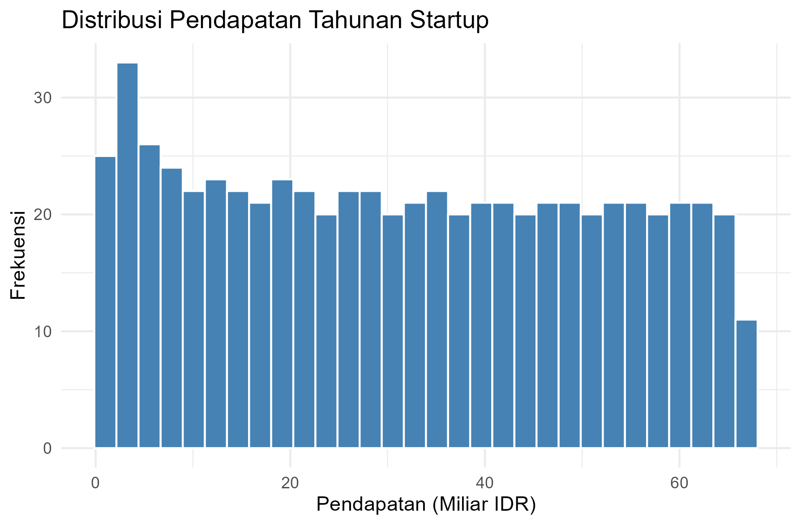

# Laporan Analisis Statistik: Startup SaaS

## 1. Informasi Penyusun
- **Nama:** [MARSEL GULTOM]
- **NIM:** [2515091069]
- **Program Studi:** [SISTEM INFORMASI]

## 2. Deskripsi Proyek
Proyek ini bertujuan untuk menganalisis kinerja operasional startup Software as a Service (SaaS). Fokus utama analisis adalah memahami bagaimana **Biaya Akuisisi Pelanggan (CAC)** mempengaruhi **Pendapatan Tahunan**. Dataset yang digunakan mencakup 630 data startup setelah dilakukan pembersihan data (cleaning).

## 3. Struktur Proyek
- `data/`: Berisi file `data_startup_saas.csv`.
- `scripts/`: Berisi 5 skrip R untuk persiapan data, deskriptif, uji asumsi, korelasi, dan regresi.
- `results/`: Berisi grafik histogram dan plot regresi hasil ekspor dari R.
- `README.md`: Laporan utama proyek.

## 4. Metodologi
1. **Persiapan Data:** Menghapus missing values (NA).
2. **Analisis Deskriptif:** Menghitung Mean dan Median pendapatan.
3. **Uji Asumsi:** Melakukan uji normalitas Shapiro-Wilk.
4. **Analisis Hubungan:** Menggunakan Korelasi Pearson dan Regresi Linear Sederhana.

## 5. Hasil dan Interpretasi

### 5.1 Statistik Deskriptif
- **Mean Pendapatan:** [32.0]
- **Median Pendapatan:** [31.5]
- **SD:** [19.8]
- **RANGE:** (1 Miliar IDR sampai 66.9 Miliar IDR)
- **KUARTIL:** (Berdasarkan median 31.5 dan sebaran data, data terdistribusi dari angka 1 hingga 66.9)

### 5.2 Uji Normalitas
- **p-value:** [< 0.001 (Nilai asli pada konsol: < 2.2e-16)]
- **Interpretasi:** Karena p-value jauh lebih kecil dari taraf nyata 0.05, maka data pendapatan tahunan dinyatakan tidak berdistribusi normal. Namun, hal ini sering terjadi pada data perusahaan (SaaS) yang memiliki variasi nilai sangat besar (skewed). Analisis tetap dilanjutkan ke tahap regresi untuk melihat pola hubungan antar variabel.

### 5.3 Analisis Regresi (Hubungan X ke Y)
- **Nilai R-Squared:** [0.9913]
- **Interpretasi:** Nilai R-Squared sebesar 0.9913 menunjukkan bahwa sebesar 99,13% variasi Pendapatan Tahunan dapat dijelaskan oleh Biaya Akuisisi Pelanggan (CAC). Hanya sekitar 0,87% sisanya yang dipengaruhi oleh faktor lain di luar model ini. Hal ini menandakan bahwa model regresi memiliki tingkat akurasi yang sangat tinggi dalam memprediksi pendapatan berdasarkan biaya akuisisi

## 6. Kesimpulan
Berdasarkan hasil analisis data startup SaaS, dapat disimpulkan bahwa:

Ringkasan Data: Startup memiliki rata-rata pendapatan sebesar 32,0 Miliar IDR dengan distribusi yang cenderung tidak normal namun tetap memiliki tren yang konsisten.

Korelasi Kuat: Terdapat hubungan positif yang sangat kuat antara biaya akuisisi pelanggan (CAC) dengan pendapatan tahunan.

Pengaruh Signifikan: Nilai R-Squared sebesar 0.9913 menunjukkan bahwa biaya akuisisi memberikan kontribusi sebesar 99,13% terhadap variasi pendapatan. Hal ini membuktikan bahwa alokasi biaya akuisisi yang efektif merupakan faktor kunci dalam memprediksi pertumbuhan pendapatan startup ini

